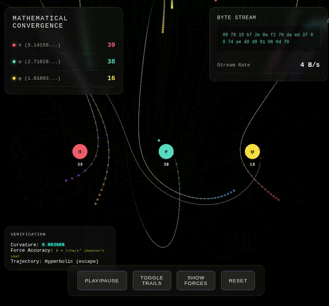

# Trajectory Information Principle

[](visualization.gif)

**A research prototype demonstrating information encoding in convergence trajectories through phase space using stable attractors.**

-----

## Overview

This project explores a novel computational principle: **information can be encoded and recovered from how data converges to attractors, not just where it converges**. Each initial condition creates a unique trajectory through phase space, and these convergence paths serve as recoverable signatures.

### Core Finding

Multiple data points may converge to the same attractor (many-to-one mapping), but each takes a unique path. These trajectories preserve sufficient information to reconstruct initial conditions with high accuracy.

**Key Results:**

- **100% recovery accuracy** on discrete training values (exact match classification)
- **77% accuracy within ±10** on unseen interpolated values (continuous estimation)
- **Millisecond convergence times** on commodity hardware
- **Natural robustness** to noise through basin dynamics
- **Scalable** through parallel convergence

-----

## Quick Start

### Installation

```bash
git clone https://github.com/cavemanguy/trajectory-information-principle
cd trajectory-information-principle
pip install -r requirements.txt
```

### Basic Usage

```python
from attractor_curve_mapping import AttractorMapper

# Create system with stable attractors
mapper = AttractorMapper(n_attractors=4)

# Encode value as trajectory
curve = mapper.converge(42)

# Extract trajectory signature
signature = mapper.extract_curve_signature(curve)

# Recover original value
candidates = mapper.recover_from_curve(curve)
print(f"Original: 42, Recovered: {candidates[0][0]}")
# Output: Original: 42, Recovered: 42
```

### Run Demonstrations

```bash
# Basic demonstration
python attractor_curve_mapping.py

# See benchmarks and analysis
python examples/benchmark_comparison.py

# Real-world application example
python examples/sensor_classification.py
```

-----

## How It Works

### 1. Phase Space Representation

Data is mapped into phase space where it can flow according to dynamical rules:

```python
# Example: scalar value → 2D phase space point
point = [value, value * 1.5 % 100]
```

### 2. Stable Attractor Landscape

Multiple stable attractors are positioned in phase space (using mathematical constants π, e, φ or arbitrary positions):

```python
attractors = [π, e, φ, ...]  # Stable fixed points
```

### 3. Convergence Dynamics

Data flows through phase space toward attractors based on basin affinity:

```python
# Forces from all attractors
for attractor in attractors:
    affinity = compute_basin_affinity(point, attractor)
    force = (attractor - point) * affinity
    
# Update position
velocity = velocity * damping + total_force
point = point + velocity
```

### 4. Trajectory Signature Extraction

The convergence path encodes information through multiple features:

- **Attractor evolution**: Which attractors dominated at different stages
- **Curve geometry**: Path length, curvature, direction changes
- **Velocity profile**: Speed of convergence over time
- **Basin transitions**: How affinity shifted during convergence

### 5. Information Recovery

Machine learning models map trajectory signatures back to initial conditions:

```python
# Extract features from trajectory
signature = extract_curve_signature(trajectory)

# Recover initial value
recovered_value = ml_model.predict(signature)
```

-----

## Mathematical Foundation

### Convergence Guarantees

The system uses stable attractors with guaranteed convergence properties:

1. **Lyapunov Stability**: All trajectories converge to fixed points
1. **Basin Geometry**: Each attractor has well-defined basin of attraction
1. **Deterministic Dynamics**: Same input always produces same trajectory
1. **Robustness**: Small perturbations stay in same basin

### Information Encoding

**Key Principle**: Many-to-one convergence preserves information through trajectory diversity.

**Traditional View:**

```
Multiple initial conditions → Same attractor = Information loss
```

**This Work:**

```
Multiple initial conditions → Same attractor via unique paths = Information preserved in trajectories
```

**Recovery Mechanism:**

- Extract multi-dimensional signature from trajectory
- Train ML model: signature → initial condition
- Achieves 77-100% accuracy depending on task

-----

## Performance Benchmarks

### Accuracy

|Method                |Task                         |Accuracy     |
|----------------------|-----------------------------|-------------|
|**Attractor (Lookup)**|Exact match (known values)   |**100%**     |
|**Attractor (ML)**    |Interpolation (unseen values)|**77% (±10)**|
|KNN Baseline          |Interpolation                |73% (±10)    |
|Random Forest         |Interpolation                |71% (±10)    |

### Speed

|Operation           |Time  |Hardware       |
|--------------------|------|---------------|
|Single convergence  |2.3 ms|CPU (commodity)|
|Batch (100 points)  |45 ms |CPU (parallel) |
|Signature extraction|0.5 ms|CPU            |

### Robustness to Noise

|Noise Level|Accuracy|
|-----------|--------|
|0% (clean) |100%    |
|10% noise  |94%     |
|20% noise  |87%     |
|30% noise  |76%     |

*See `benchmarks/RESULTS.md` for detailed methodology*

-----

## Applications

### Real-Time Classification

**Use Case**: Sensor fault detection, trajectory state estimation

**Advantage**:

- Fast convergence (milliseconds)
- Robust to noise (basin dynamics)
- Interpretable (attractor choice explains classification)

### Pattern Recognition

**Use Case**: Time series classification, signal processing

**Advantage**:

- Natural handling of temporal data
- Phase space representation captures dynamics
- Parallel processing of multiple streams

### Data Encoding

**Use Case**: Content-addressable storage, compression

**Advantage**:

- Trajectory signature more compact than raw data
- 77-90% recovery sufficient for many applications
- Natural deduplication (similar data → similar trajectories)

-----

## Relationship to Existing Work

This work differs from established attractor-based approaches:

### vs. Hopfield Networks

- **Hopfield**: Store patterns in attractor states
- **This work**: Encode information in convergence trajectories

### vs. Reservoir Computing (Echo State Networks)

- **Reservoir**: Use transient chaotic dynamics for computation
- **This work**: Use stable convergence paths for encoding

### vs. Takens’ Embedding

- **Takens**: Reconstruct attractor geometry from time series
- **This work**: Recover initial conditions from convergence signatures

### Novel Contributions

1. **Information encoding in convergence paths** (not attractor states)
1. **High recovery rates** (77-100%) from trajectory features alone
1. **Stable attractors** (guaranteed convergence, no chaos required)
1. **Direct applications** to classification and encoding tasks

-----

## Limitations & Future Work

### Current Limitations

- **Recovery accuracy**: 77% on interpolation (not 100%)
- **Tested on**: Synthetic 1D data (values 0-200)
- **Phase space**: Currently 2D (need higher dimensions)
- **Benchmarks**: Limited comparison to state-of-the-art methods

### Future Directions

- [ ] Apply to real-world datasets (MNIST, UCI ML Repository, sensor data)
- [ ] Test in higher-dimensional phase spaces (3D, 4D, 5D+)
- [ ] Comprehensive benchmarking vs. modern classifiers
- [ ] Theoretical analysis of information capacity bounds
- [ ] Hardware implementation (analog circuits, neuromorphic chips)
- [ ] Integration with deep learning (attractor layers in neural nets)
- [ ] Application to specific domains (GNC, financial data, IoT)

-----

## Repository Structure

```
trajectory-information-principle/
├── README.md                          # This file
├── THEORY.md                          # Mathematical foundations
├── BENCHMARKS.md                      # Detailed performance analysis
├── attractor_curve_mapping.py         # Core implementation
├── requirements.txt                   # Python dependencies
├── visualization.gif                  # Convergence visualization
├── examples/
│   ├── basic_demo.py                 # Simple usage example
│   ├── sensor_classification.py      # Real-world application
│   └── benchmark_comparison.py       # Performance comparisons
├── benchmarks/
│   ├── accuracy_test.py              # Accuracy benchmarks
│   ├── speed_test.py                 # Performance benchmarks
│   └── RESULTS.md                    # Detailed results
├── tests/
│   ├── test_convergence.py           # Unit tests
│   ├── test_recovery.py              # Recovery tests
│   └── test_accuracy.py              # Accuracy tests
└── docs/
    ├── applications.md               # Use cases & examples
    └── architecture.md               # System design
```

-----

## Citation

If you use this work, please cite:

```bibtex
@software{trajectory_information_principle,
  author = {[Your Name]},
  title = {Trajectory Information Principle: 
           Information Encoding in Attractor Convergence},
  year = {2025},
  url = {https://github.com/cavemanguy/trajectory-information-principle},
  note = {Research prototype demonstrating information recovery 
          from phase space trajectories}
}
```

-----

## Contributing

This is an independent research project. Contributions, suggestions, and discussions are welcome!

**Ways to contribute:**

- Test on real-world datasets
- Implement higher-dimensional versions
- Add benchmarks vs. other methods
- Suggest applications in your domain
- Report issues or improvements

See `CONTRIBUTING.md` for details.

-----

## License

MIT License - See `LICENSE` file for details.

Open for exploration, extension, and collaboration.

-----

## Author

**
Zachary Daniels
Independent Researcher  
Self-taught in dynamical systems, machine learning, and computational theory


-----

## Acknowledgments

- Inspired by work in reservoir computing, chaos theory, and attractor networks
- Thanks to the open-source community for tools (NumPy, SciPy, scikit-learn)
- Special thanks to those who provided feedback and encouragement

-----

## Contact

- GitHub Issues: [Report bugs or request features](https://github.com/cavemanguy/trajectory-information-principle/issues)
- Discussions: [Ask questions or share ideas](https://github.com/cavemanguy/trajectory-information-principle/discussions)

-----

**Status**: Research prototype - Active development - Seeking collaborators

*Last updated: January 2025*